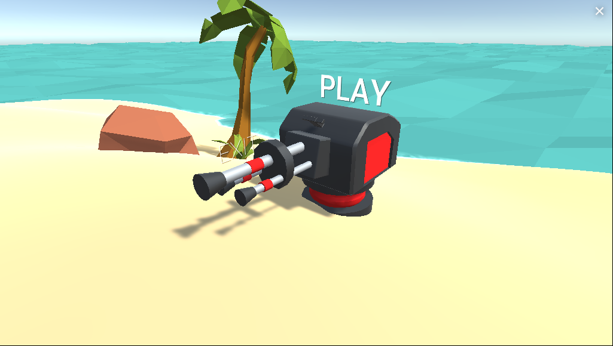
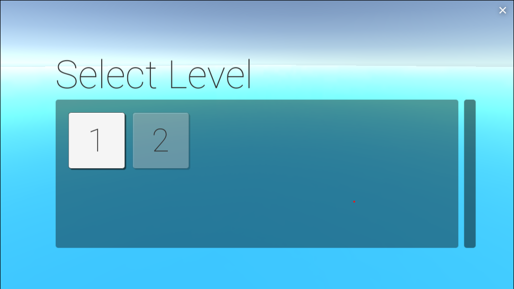
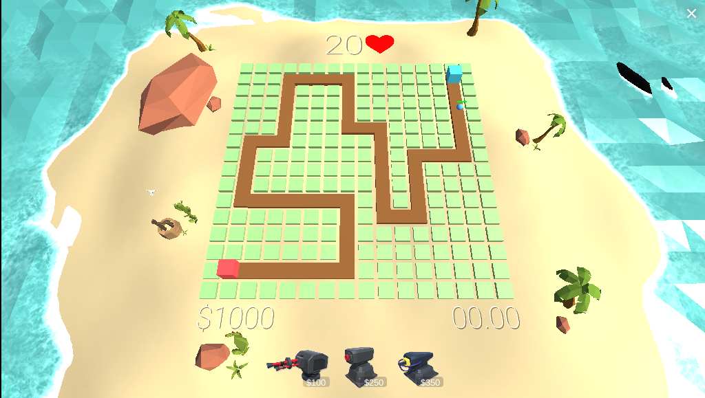

# TowerDefend
 

My first complete Unity game

## Gameplay
https://play.unity.com/mg/other/towerdef-webgl

## ScreenShots
&nbsp;&nbsp;&nbsp;&nbsp;&nbsp;&nbsp;

## Features

* Tower Defend game

## Sources

* <a href="https://assetstore.unity.com/">Unity Asset Store</a>
* <a href="https://www.zapsplat.com/">Zapsplat</a>: Audio asset store
* <a href="https://www.youtube.com/watch?v=4W0sosJtiGg">Youtube.com/WikiaColors</a>: Background music
